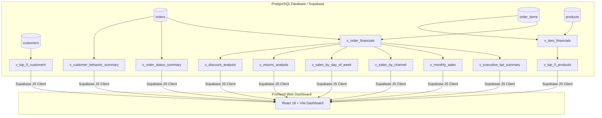

# 🍽️ Restaurant Sales Analytics Mini System
> **لوحة تحليلات مبيعات المطعم — Executive Dashboard**

A standalone, professional web application and PostgreSQL analytics engine designed for restaurant sales tracking, financial KPI calculations, and data visualization using **Supabase**, **PostgreSQL**, **React 18**, **TypeScript**, **Vite**, and **Tailwind CSS**. 

This system prepares structured, verified financial metrics for future **n8n workflows**, **AI Sales Agents**, and **RAG (Retrieval-Augmented Generation)** integration.

---

## 📌 Project Overview

- **Project Name:** Restaurant Sales Analytics Mini System
- **Target Platform:** Web Application (Responsive for Desktop, Tablet, and Mobile)
- **Primary Stack:** React 18, Vite, TypeScript, Tailwind CSS, Recharts, Lucide Icons, Supabase, PostgreSQL
- **Currency Context:** SAR (Saudi Riyal)
- **Timezone Context:** Asia/Riyadh (`+03:00`)
- **Verified Dataset Period:** June 1, 2026 – August 31, 2026 (3 Full Calendar Months)
- **Verified Dataset Size:** 60 Customers, 25 Products, 380 Orders, 968 Order Line Items (0 Orphan Items)

---

## 📊 Executive KPI Summary (Verified Phase 4 & Phase 17A)

| Executive KPI Metric | Verified Value | Calculation Formula / Description |
| :--- | :---: | :--- |
| **Gross Sales** | **60,325.00 SAR** | $\sum (\text{quantity} \times \text{unit\_price\_at\_sale})$ |
| **Item-Level Discounts** | **222.40 SAR** | $\sum (\text{line\_discount})$ |
| **Order-Level Discounts** | **420.00 SAR** | $\sum (\text{header discount\_amount})$ |
| **Total Discounts** | **642.40 SAR** | Item Discounts + Order Discounts |
| **Total Returns** | **2,330.12 SAR** | $\sum (\text{return\_amount})$ |
| **Net Sales** | **57,352.48 SAR** | Gross Sales - Total Discounts - Total Returns |
| **Counted Orders** | **365 Orders** | Completed + Returned + Partially Returned (Excludes Cancelled) |
| **Average Order Value (AOV)** | **157.13 SAR** | Net Sales / Counted Orders |

---

## 📅 Monthly Sales Performance & Growth

| Month | Gross Sales | Total Discounts | Total Returns | Net Sales | Counted Orders | AOV | MoM Growth % |
| :--- | :---: | :---: | :---: | :---: | :---: | :---: | :---: |
| **June 2026** | 16,186.70 SAR | 200.00 SAR | 510.00 SAR | **15,476.70 SAR** | 107 | 144.64 SAR | *Baseline* |
| **July 2026** | 21,543.30 SAR | 262.40 SAR | 920.00 SAR | **20,360.90 SAR** | 118 | 172.55 SAR | **+31.56%** 🚀 |
| **August 2026** | 22,595.00 SAR | 180.00 SAR | 900.12 SAR | **21,514.88 SAR** | 140 | 153.68 SAR | **+5.67%** 📈 |

---

## 🏗️ Architecture & Database View Layer

The application connects directly (read-only) to **10 pre-aggregated PostgreSQL analytics views** built on top of the transactional schema:



---

## 📁 Repository Structure

```text
restaurant-sales-analytics-mini/
├── database/
│   ├── schema.sql                 # Safe PostgreSQL DDL table definitions
│   ├── reset_schema.sql           # Teardown script (development reset)
│   ├── seed.sql                   # Phase 3 deterministic seed dataset (380 orders, 968 items)
│   ├── validate_seed.sql          # Seed data integrity validation suite
│   ├── analytics.sql              # Phase 4 PostgreSQL views & analytics layer DDL
│   └── validate_analytics.sql     # Analytics validation query suite
├── docs/
│   └── DATABASE_DICTIONARY.md     # Comprehensive data dictionary & calculation logic
├── frontend/                      # Web Application Frontend
│   ├── index.html                 # Main HTML template
│   ├── package.json               # Node dependencies & npm scripts
│   ├── vite.config.ts             # Vite build & alias configuration
│   ├── tsconfig.json              # TypeScript configuration
│   ├── tailwind.config.js         # Tailwind CSS styling theme
│   ├── postcss.config.js          # PostCSS processing
│   ├── vercel.json                # Vercel SPA rewrite configuration
│   ├── .env.example               # Environment variables template
│   ├── .env                       # Local environment file (Git ignored)
│   └── src/
│       ├── main.tsx               # App entry point
│       ├── index.css              # Global styles & scrollbar setup
│       ├── types/analytics.ts     # TypeScript interface definitions
│       ├── lib/supabase.ts        # Supabase client & fallback detector
│       ├── services/analyticsService.ts # Live API fetcher & offline snapshot
│       └── components/
│           ├── Header.tsx                 # Header navigation & status badges
│           ├── Sidebar.tsx                # Responsive sidebar / mobile drawer
│           ├── KpiCard.tsx                # Executive KPI summary cards
│           ├── MonthlyPerformanceTable.tsx# Monthly sales breakdown & MoM badges
│           ├── SalesTrendChart.tsx        # Recharts monthly area & day-of-week bar charts
│           ├── ChannelBreakdownChart.tsx  # Dine-in, Takeaway & Delivery donut chart
│           ├── ProductPerformanceTable.tsx# Top 5 products by net sales
│           ├── OrderStatusChart.tsx       # Order status distribution
│           ├── CustomerInsights.tsx       # Top customers & loyalty ratio
│           ├── ReturnsDiscountsCard.tsx   # Returns & discount impact
│           └── LoadingSpinner.tsx         # Dashboard loading spinner
└── README.md                      # Project documentation
```

---

## 🚀 Getting Started (Local Development)

### 1. Prerequisites
- Node.js `v18+` or `v24+`
- npm `v9+` or `v11+`

### 2. Installation
```bash
# Navigate to frontend directory
cd frontend

# Install dependencies
npm install
```

### 3. Environment Setup
Create a `.env` file inside `frontend/`:
```env
VITE_SUPABASE_URL=https://your-supabase-project.supabase.co
VITE_SUPABASE_ANON_KEY=your-supabase-anon-public-key
```
*(Note: If environment keys are left blank, the frontend automatically activates zero-downtime offline fallback mode with the exact verified Phase 4 analytical snapshot).*

### 4. Run Locally
```bash
# Start local development server
npm run dev
```
Open [http://localhost:3000/](http://localhost:3000/) in your browser.

### 5. Build for Production
```bash
# Compile TypeScript & bundle with Vite
npm run build
```
Production output will be generated in `frontend/dist/`.

---

## 🔒 Security & Least Privilege Access Model

- **Read-Only Supabase Connection:** The frontend only uses the public `anon` publishable key.
- **Service Role Exclusion:** `service_role` keys are **never** exposed in code or configuration.
- **View-Level Security Grants:** The database grants `SELECT` access strictly to pre-aggregated analytics views (`v_executive_kpi_summary`, etc.). Direct `SELECT` access to raw transactional tables (`orders`, `customers`) remains restricted.

---

## 🌐 Production Deployment (Vercel)

To deploy to Vercel:
1. Connect your GitHub repository to Vercel.
2. Set **Root Directory** to `frontend`.
3. Set **Framework Preset** to `Vite`.
4. Set **Build Command** to `npm run build` and **Output Directory** to `dist`.
5. Add Environment Variables:
   - `VITE_SUPABASE_URL`
   - `VITE_SUPABASE_ANON_KEY`
